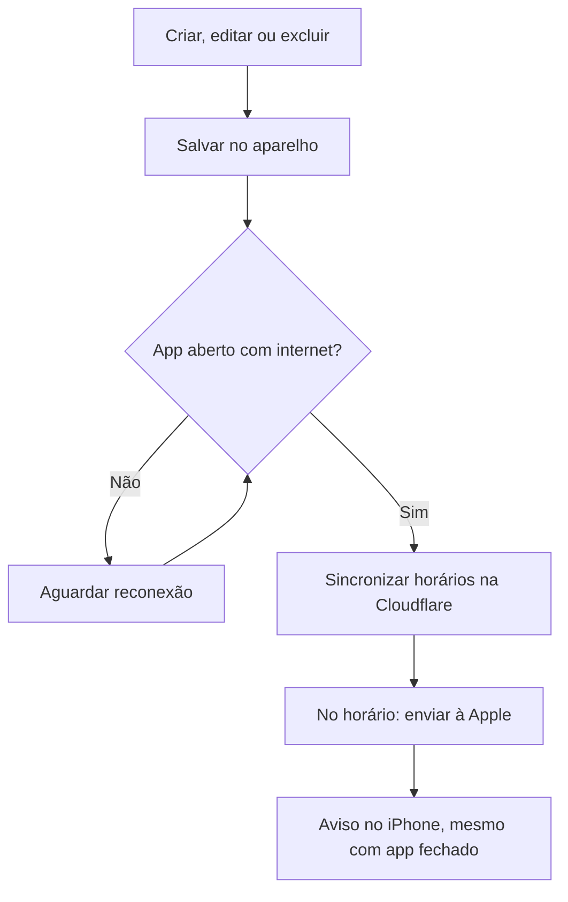

<p align="center">
  
</p>

<h1 align="center">🌷 Um sonho de rotina</h1>
<p align="center"><strong>Uma agenda pessoal criada por David Boneli para a Fabíola.</strong><br>Compromissos, cuidados e tempo para si, em um planner visual e acolhedor.</p>

<p align="center">📱 Safari / PWA · 📅 Agenda offline · 🔔 Lembretes online · 🔐 PIN · 💾 Backup</p>

> O aplicativo deve se adaptar à rotina da Fabi, e não obrigar a Fabi a se adaptar ao aplicativo.

**Navegação rápida:** [Recursos](#-o-que-o-app-faz) · [Primeiros passos](#-primeiros-passos) · [Notificações](#-como-os-lembretes-chegam) · [Backup](#-dados-e-backup) · [Validação](#-o-que-foi-verificado) · [Código](#-para-desenvolver)

## 💗 Por que este projeto existe

Reunir a rotina da Fabi em um só lugar: organizar compromissos e tarefas, acompanhar medicamentos e reservar espaço para objetivos pessoais. O visual usa ilustrações, cores e decoração personalizáveis, com sugestões de atividades que só entram na agenda após a aprovação dela.

É um projeto de uso pessoal. A versão utilizada é um **app web instalado pelo Safari na Tela de Início do iPhone**. Não exige distribuição pela App Store; a versão nativa permanece como referência no código.

## ✨ O que o app faz

| | Recurso | No dia a dia |
|---|---|---|
| 📅 | **Agenda e calendário** | Consultar Hoje, Semana e Agenda; visualizar destaques no calendário mensal. |
| 📝 | **Compromissos e tarefas** | Incluir, editar e excluir; usar horários, períodos, dia inteiro, notas e checklist. |
| 🔁 | **Recorrências** | Repetir semanalmente, mensalmente ou anualmente e editar uma ocorrência ou as futuras. |
| ⏰ | **Conflitos** | Alertar sobre sobreposição de horários, deixando a decisão com a usuária. |
| 💊 | **Medicamentos** | Cadastrar horários, foto e dose; confirmar tomadas e consultar o histórico. |
| 🎯 | **Objetivos** | Definir metas de tempo diárias ou mensais e registrar o que foi realizado. |
| 💡 | **Sugestões** | Encontrar horários livres e oferecer atividades; nada é marcado sem confirmação. |
| 🎨 | **Personalização** | Escolher temas, cores, títulos, tamanho do texto, flores e corações. |
| 🔔 | **Lembretes** | Receber avisos online com o app fechado, após ativação e sincronização. |
| 🔐 | **Acesso** | Usar PIN de seis dígitos e recuperação local. Face ID não está disponível na PWA. |
| 💾 | **Backup** | Exportar e restaurar os registros por arquivo, com confirmação antes de substituir a agenda. |

A primeira abertura começa sem compromissos ou medicamentos fictícios.

## 📱 Primeiros passos

| Etapa | O que fazer |
|---|---|
| **1 · Instalar** | Abrir o endereço privado no Safari → Compartilhar → Adicionar à Tela de Início. |
| **2 · Entrar** | Abrir pelo ícone, criar o PIN e guardar a chave de recuperação. |
| **3 · Preparar offline** | Manter internet até aparecer **“Pronto para usar offline”** em Ajustes. |
| **4 · Ativar avisos** | Em Lembretes, conectar com o código privado e permitir notificações. Essa configuração já foi feita no aparelho da Fabi. |
| **5 · Usar** | Cadastrar compromissos com lembrete e aguardar a confirmação de sincronização. |

**Para quem já usa:** não reinstale nem refaça a ativação a cada atualização. Use **Ajustes → Verificar atualização → Atualizar agora e reabrir**.

📖 [Guia de instalação e uso no Safari](docs/INSTALACAO-SAFARI.md)

## 🔔 Como os lembretes chegam



| 📶 Com internet | 📴 Sem internet |
|---|---|
| Sincronizar novos horários, alterações e cancelamentos. | Consultar e editar a agenda após preparar o acesso offline. |
| Receber as notificações programadas. | Alterações aguardam reconexão com o app aberto. |
| Verificar e baixar atualizações. | Avisos antigos no servidor só são atualizados na próxima sincronização. |

Os avisos permitem **som**, conforme os ajustes de notificações, modo silencioso e Foco do iPhone. A entrega depende da conexão, das permissões e dos ajustes do iPhone; o agendamento é consultado a cada minuto, sem garantia de segundo exato. Sugestões de atividades aparecem **dentro do app**.

O app programa até **4.000 avisos em uma janela de 366 dias** e informa a cobertura em Ajustes. Abra-o regularmente para renovar a programação. Avisos já entregues ao sistema não podem ser recolhidos.

🔧 [Funcionamento e configuração do serviço](docs/NOTIFICACOES_WEB.md)

## 💾 Dados e backup

| Informação | Onde fica |
|---|---|
| Agenda, notas, metas e histórico | No navegador/aparelho; não há sincronização da agenda entre dispositivos. |
| Horários dos lembretes e inscrição do aparelho | No serviço de notificações, com mensagens genéricas. |
| PIN e código de ativação | Fora do backup da agenda. O código privado não pertence ao GitHub. |
| Retratos da família | Na versão privada; não são incluídos no repositório público. |

**Rotina recomendada:** em Ajustes, toque em **Salvar backup** e confira o arquivo em Arquivos/Downloads. Faça uma cópia antes de restaurar ou trocar de aparelho.

O PIN controla o acesso, mas não criptografa a agenda. O backup também não é criptografado. Limpar dados do site ou perder o armazenamento local pode apagar registros; o serviço de notificações **não é uma cópia da agenda**.

## ✅ O que foi verificado

| Verificação | Evidência |
|---|---|
| Aviso de teste com iPhone bloqueado | ✅ Confirmado por David em 21/09/2026. |
| Lembrete de compromisso real | ✅ Confirmado no aparelho e por foto em 21/09/2026. |
| Alteração/exclusão, recorrências e medicamentos | 🧪 Testes automatizados com dados fictícios. |
| Edição offline e envio ao reconectar | 🧪 Teste do cliente com rede simulada. |
| Exportação/restauração de backup preenchido | 🧪 Teste isolado, sem acessar os dados da Fabi. |
| Cache offline e abertura pela notificação | 🧪 Simulação do service worker. |
| Edição/exclusão e medicamento no iPhone | ⏳ Conferência final no aparelho ainda pendente. |

Os testes automatizados não substituem a entrega real no iPhone. Veja o [registro de revisão](docs/REVISAO-2026-09-21.md) para os resultados e limites.

## 🛠 Para desenvolver

<details>
<summary><strong>Executar o app e gerar a versão web</strong></summary>

Use Node.js 22 ou superior e instale as dependências com o arquivo de versões do projeto.

```powershell
npm ci
npm run web
npm run build
```

O comando `build` gera `dist`, com manifesto e cache offline. Sirva por HTTPS. O servidor de desenvolvimento não habilita o cache offline.

</details>

<details>
<summary><strong>Verificar código, agenda e serviço de avisos</strong></summary>

```powershell
npm run typecheck
npm test
cd notifications
npm ci
npm test
npm run check
```

`npm run check`, na pasta `notifications`, apenas verifica o empacotamento; não publica o serviço. As chaves privadas ficam nos segredos da Cloudflare, nunca no código.

</details>

### 🗂 Mapa do projeto

| Caminho | Responsabilidade |
|---|---|
| `App.tsx` | Navegação e coordenação dos fluxos. |
| `src/domain.ts` | Agenda, recorrências, conflitos, objetivos e doses. |
| `src/notificationModel.ts` | Seleção dos lembretes futuros. |
| `src/webPush.ts` | Ativação e sincronização dos avisos online. |
| `src/backup.ts` | Exportação e validação de backups. |
| `src/platform.ts` | Persistência, credenciais e integração de plataforma. |
| `notifications/` | Serviço Cloudflare, banco e testes de envio. |
| `scripts/build-pwa.cjs` | Pacote offline e service worker. |
| `tests/` | Testes da agenda, backup, reconexão e interface. |
| `assets/` | Ícone e ilustrações; retratos pessoais fora do GitHub público. |

## 📚 Documentação

| Guia | Assunto |
|---|---|
| [📱 Safari](docs/INSTALACAO-SAFARI.md) | Instalação, atualização e backup. |
| [🔔 Notificações](docs/NOTIFICACOES_WEB.md) | Arquitetura, ativação e manutenção. |
| [✅ Revisão](docs/REVISAO-2026-09-21.md) | Resultados e verificações pendentes. |
| [📋 Requisitos](docs/REQUISITOS.md) | Escopo consolidado do projeto. |
| [🎨 Design](docs/DESIGN.md) | Identidade visual e imagens. |
| [🧩 Implementação](docs/IMPLEMENTACAO.md) | Recursos atuais e limitações. |

---

Projeto pessoal de **David Boneli**, feito para a **Fabi**. Sem licença de redistribuição definida nesta etapa.
